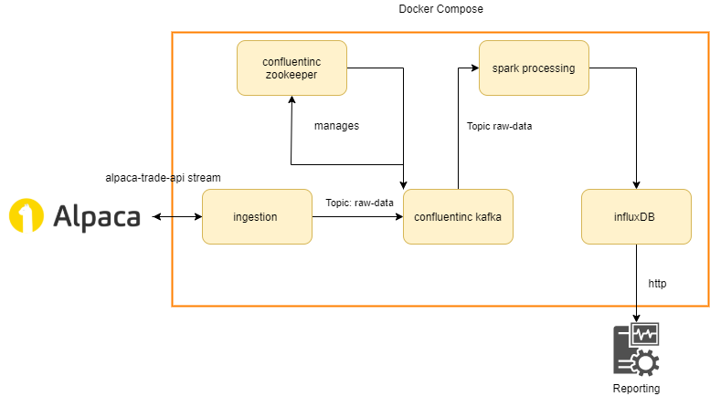
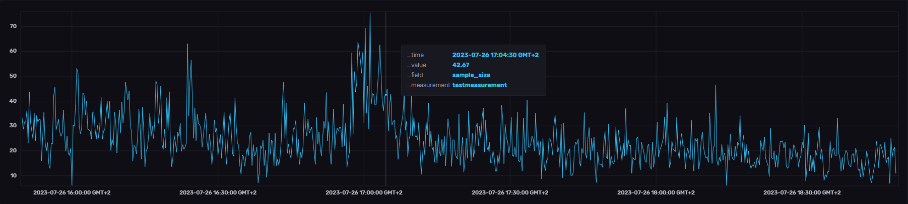
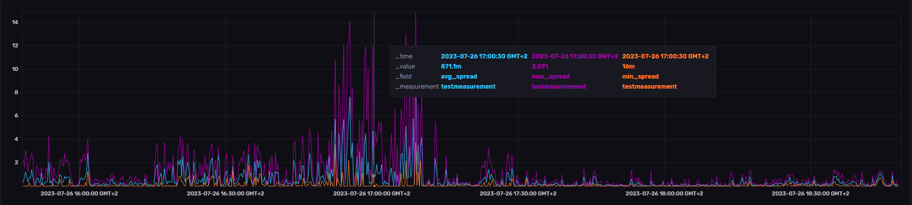

alpaca-market-stream is a docker based streaming solution to calculate, aggregate and save the spread of a given stock in real time. The application recieves quotes from alpaca, the spread is calculated as the difference between ask and bid price and aggregated. For each timeframe different metrics are calculated. The microservice architecure looks as follows:

### How to run

- To use it you need to obtain access to [alpaca.markets](https://alpaca.markets/), see the [getting started documentation](https://alpaca.markets/docs/market-data/getting-started/).
- [Download and install docker](https://www.docker.com/products/docker-desktop/)
- Create `config.py` using the `example_config.py` as a template
- Fill in your alpaca key and secret
- Change credentials in `config.py` and `docker-compose.yaml` if wished
- Change `STOCK_CODE` if needed
- Start docker
- Start the application via docker compose `docker-compose up --build`

### See output
- Navigate to http://localhost:8086/
- Log in with the placeholder credentials (or your changed ones)
- Explore -> FROM testbucket -> Filter testmeasurement -> select metrics -> Submit
- Change settings, view raw data and create dashboards directly in the influxDB GUI
- To see active spark jobs, navigate to http://localhost:4040/jobs/

### Examples

The following plots show a full day (2023-06-27 within the opening hours of the stock exchange) of processing AAPL quotes. Data is displayed as moving average with a window of 120 seconds. Velocity peaked at 361 quotes per second.

